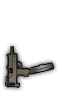

#### CB6 contents and their creators:
- Attack dogs (Kiruex)  \
  
- Cavalry saber (Kiruex)  \
  
- KSxS-6 Hunter double-barrel shotgun with double shot mode (Kiruex)  \
   
- Demolisher UGV plus remote detonator (Kiruex)  \
   
- XM29 OICW with remote and automatic airburst modes (warbrand2 & Kiruex)  \
   
- Gadkaia Merzost twin rifle abomination (Kiruex)  \
  
- Ultimax 100 reverse-recoil light machine gun (Kiruex)  \
   
- AK47 Flamer (warbrand2)  \
   
- Ash 12 (Kiruex)  \
   
- QLU-11 sniper grenade launcher (Xe-No & GhostNZ)  \
  
- Paint Sprayer (Kiruex)  \
   
- AEK999 (Marcus & KF redfox)  \
  
- dp28 - shield (KF redfox)  \
  
- Gilboa DBR (NC0032 & KF redfox)  \
  
- PP19 - Vityaz (NC0032 & KF redfox)  \
  
- PP19 - Vityaz SD (NC0032 & KF redfox)  \
  
- PP2000 (NC0032 & KF redfox)  \
  
- PP2000 SD (NC0032 & KF redfox)  \
  
- M99 (KF redfox)  \
  
- Mac10 w/ bayonet (KF redfox)  \
   
- qbz-95 w/ underbarrel shotgun (oche34 & KF redfox)  \
  
- RPD w/ bipod (oche34 & KF redfox)  \
   
- Shumikha Launcher (KF redfox)  \
  
- XM - 556 (NC0032 & KF redfox)  \
  
- President Skins (Veliki Shef)
- Colt Ranger (CN memories & KF redfox)  \
  
- Gaint Sword (KF redfox)  \
  
- M30 rifle/shotgun (Unit G17 & CN memories & KF redfox)  \
   
- CMGL-12 (Waltarron)  \
  
- X12-XREP (Waltarron)  \
  
- Merkava Tank (Unit G17)
- VFS moddable vehicle + workstations (Xe-No & Return_Dirt & KF Redfox)
- F2000EGLM (Waltarron)  \
   
- Assault Rifles with Underbarrel Grenade Launchers (Unit G17)  \
     \
     \
   
- American 180 ( KF redfox)  \
  

#### Other stuff:
- Rangefinder binoculars (Unit G17)
- Ninjato animation tweaks (Kiruex)
- Golden Knife rework (Kiruex)
- Costume rework (Kiruex)
- Additional L30P models and model tweaks + Ninjato samurai (Kiruex)
- Bonus soldier models for specific weapon-vest combinations (Kiruex)
- Ninjato firecracker mode (Kiruex)
- Compound Bow explosive mode (Kiruex)
- 44 Magnum reanimation and rapid fire mode (Kiruex)
- Ammo backpacks for WB-II Microgun and KAC Chain SAW (warbrand2)
- Flamethrower rework and fuel backpack (Kiruex)
- Basket adding bayonet and skins (KF redfox)
- mp5 supressed model rework (ammo guy)
- Addons added for rpgs (CN memories)
- Medic skins (CN memories)
- NS2000S (Unit G17 & KF Redfox)
- G11 rework (KF Redfox)

#### Rebalancing project:
- Dragon's Breath projectile gravity decreased [pulldown_in_air: 25 -> 18]
- Flamethrower ballistics redone [-> `<ballistics near_far_distance="100.0" speed_estimation_near="25.0" speed_estimation_far="25.0" max_speed="25.0" randomness="0.05" />` ]
- Chain Saw damage significantly increased to reliably cut down weaker vehicles and emplacements [blast damage: 0.01 -> 0.07]
- Stoner 62 recoil decreased [sustained_fire_grow_step: 0.4 -> 0.35] and recovery increased [sustained_fire_diminish_rate: 1.2 -> 1.4], decreased stance accuracy rate [<blank> -> `stance_accuracy_rate="1.0"` ?]
- AAC Honey Badger recoil decreased [sustained_fire_grow_step: 0.38 -> 0.34], range slightly increased [kill_decay_start_time: 0.34 -> 0.36, kill_decay_end_time: 0.52 -> 0.56]
- ARES Shrike recoil redone to behave similarly to G11 [accuracy_factor: 0.8 -> 0.9, sustained_fire_grow_step: 0.2 -> 0.1, sustained_fire_diminish_rate: 1.4 -> 0.4], added semi automatic mode
- All shotguns with 0.6 recoil recovery: recovery rate increased to 0.9
- Mossberg 500 accuracy significantly improved to compensate for less power and projectile amount than SPAS-12 [accuracy_factor: 0.7 -> 0.8, sustained_fire_diminish_rate: 0.6 -> 0.9]
- Steyr TMP kill probability [0.5 -> 0.51] and walking accuracy [0.7 -> 0.8] increased, recoil decreased [sustained_fire_grow_step: 0.3 -> 0.26]
- Mini UZI kill probability [0.45 -> 0.53] and walking accuracy [0.7 -> 0.8] increased, recoil decreased [sustained_fire_grow_step: 0.32 -> 0.28]
- AEK-919k kill probability [0.46 -> 0.55] and walking accuracy [0.7 -> 0.8] increased, recoil decreased [sustained_fire_grow_step: 0.35 -> 0.31]
- Compound Bow effective range significantly increased [kill_decay_start_time: 0.1 -> 0.6]
- Buckshot Bess Musket reload time decreased [reload_anim_speed: 0.3 -> 0.4]
- PF-98 reload time decreased [reload_anim_speed: 0.35 -> 0.5]
- Sawn-Off Shotgun reload time decreased [reload_anim_speed: 0.3125 -> 0.4]
- Dragon's Breath reload time decreased [reload_anim_speed: 0.3125 -> 0.4]
- TTI-Combat Shield range increased [kill_decay_start_time: 0.22 -> 0.25], standing accuracy increased [0.85 -> 0.9, over_wall: 0.85 -> 0.9, sustained_fire_diminish_rate: 0.6 -> 0.9], reload speed increased [reload_anim_speed: 0.66 -> 0.8], and projectile speed increased [80 -> 90]
- M6 Lynx recoil recovery rate increased [sustained_fire_diminish_rate: 0.5 -> 0.9], firing 50 cal BMG projectile, accuracy lowered [over_wall: 0.95 -> 0.85]
- Barrett M107 recoil recovery rate increased [sustained_fire_diminish_rate: 0.5 -> 0.8], firing 50 cal BMG projectile, accuracy lowered [over_wall: 0.95 -> 0.85]
- APR recoil recovery rate increased [sustained_fire_diminish_rate: 0.5 -> 0.9]
- M24-A2 recoil recovery rate increased [sustained_fire_diminish_rate: 0.55 -> 0.75]
- PSG-90 recoil recovery rate increased [sustained_fire_diminish_rate: 0.5 -> 0.7]
- Dragunov SVD accuracy factor decreased [1 -> 0.96] and projectile speed decreased [185 -> 170]
- Scorpion Evo III range increased [kill_decay_start_time: 0.24 -> 0.25, kill_decay_end_time: 0.36 -> 0.42]
- QCW-05 range increased [kill_decay_start_time: 0.23 -> 0.24, kill_decay_end_time: 0.37 -> 0.4]
- MK23 SOCOM recoil adjustments [sustained_fire_grow_step: 0.5 -> 0.2, sustained_fire_diminish_rate: 1.0 -> 0.6]
- Beretta 93R recoil adjustments [sustained_fire_grow_step: 0.6 -> 0.25, sustained_fire_diminish_rate: 1.2 -> 0.7]
- Glock 17 fire rate increased [retrigger_time: 0.3 -> 0.2]
- Beretta M9 fire rate increased [retrigger_time: 0.28 -> 0.25], range increased [kill_decay_start_time: 0.3 -> 0.35, kill_decay_end_time: 0.35 -> 0.4], kill probability increased [0.4 -> 0.45], and recoil slightly decreased [sustained_fire_grow_step: 0.8 -> 0.7]; tag changed from "assault" to "stealth"
- M712 Schnellfeuer projectile speed increased [90 -> 100]
- Milkor MGL uses a cycle animation instead of retrigger timer to prevent reload spam, reload speed increased [reload_anim_speed: 0.8 -> 1.25]
- UMP40, MX4 Storm and PP-19 Bizon now treated as rare weapons with appropriate ownership lock and despawn time
- Commonness reduced for Mossberg 500 [0.02 -> 0.01], M240 [0.05 -> 0.02], IMI Negev [0.05 -> 0.02], and PKM [0.05 -> 0.02]
- Black Ops vest can survive one small blast (reason for change: grenadiers)
- AI soldiers now have 1/5 chance to spawn with Vest, type III instead of  Vest, type II (reason for change: variety)
- PF-98 rocket damage buffed from 5.2 to 6.4 (proposed by warbrand2) so that it one shots weakest APC, cripples middle APC, and moderately damages the big APC

#### What's left:
- ~~M30 Drilling with different shell types (Unit G17)~~
- ~~M4 Carbine w/ M203 underbarrel grenade launcher (Unit G17)~~
- ~~M4 or G36 w/ M26 MASS underbarrel shotgun (Seveleven)~~
- Other CB6 submissions
- AA-12 Frag and PAW-20 still need rebalancing and anti-desync solution
- Map18 community project + Merkava tank
- Iron Enclave insurgents
- Make dog_radio.weapon not consume and not spawn the call on maps with flares disabled (Tropical Blizzard, Copehill Down)
- Maybe some more easter egg soldier skins that involve combining Golden Knife or Cavalry Saber with something else

#### Notes:
- Changed items are available in armory for testing purposes
- Some unchanged items such as EOD vest, Type III vest, taser, L30P-DUALIST included in armory just to have soldier bonus skins readily available
- MUSKET COMMONNESS REDUCED TO ZERO TO PREVENT AI SPAWNING WITH IT, REVERT TO 0.2 WHEN DONE TESTING

#### Skins:
##### Faction:
- T3 + Stoner LMG (green only)
- T3 + Barrett M107 (green only)
- T3 + F2000 (grey only)
- T3 + XM8 (grey only)
- T3 + AKS-74 (brown only)
- T3 + VSS (brown only)
- EOD + M79 (green only)
- EOD + GL06 (grey only)
- EOD + RGM40 (brown only)
- T2 + Medical Dart Gun

##### Wohn Jicks:
- Ghillie + L30P
- T3 + L30P
- EOD + L30P

##### Rambo man:
- M60 + Golden Knife
- M60 + Cavalry Saber
- Blowgun + Golden Knife
- Blowgun + Cavalry Saber
- Compound Bow + Golden Knife
- Compound Bow + Cavalry Saber

##### Dragon Lizard:
- Lizard + Flamethrower
- Lizard + Dragon's Breath
- Lizard + Ninjato

##### Riot gear:
- TTI-Combat Shield + taser
- Pepperdust + taser
- UTS-15 + taser
- Neostead 2000 + taser
- MGL Flasher + taser
- ~~Benelli M4 + riot shield~~
- AA-12 + riot shield

##### Cowboys:
- 44 Magnum + Golden Knife
- 44 Magnum + Cavalry Saber
- M711-LA Enforcer + Golden Knife
- M711-LA Enforcer + Cavalry Saber
- KSxS-6 Hunter + Golden Knife
- KSxS-6 Hunter + Cavalry Saber

##### Musketeer:
- Buckshot Bess Musket + Golden Knife
- Buckshot Bess Musket + Cavalry Saber

##### Samurai:
- EOD + Ninjato
- Ninjato + Golden Knife
- Ninjato + Cavalry Saber

#####  Medieval armors:
- Double-handed Sword + V2(five stars)
- Double-handed Sword + V3
- Double-handed Sword + camo vest
- Double-handed Sword + eod
- Double-handed Sword + black ops
- Double-handed Sword + exo

##### Tachanka：
- Shumika + eod
- dp28 + eod

##### Line infantries：
- Musket + V2（5stars）
- Musket + V3

##### Ringers：
- colt ranger + V2（5stars）

##### Medics：
- medkit
- medkit + V2
